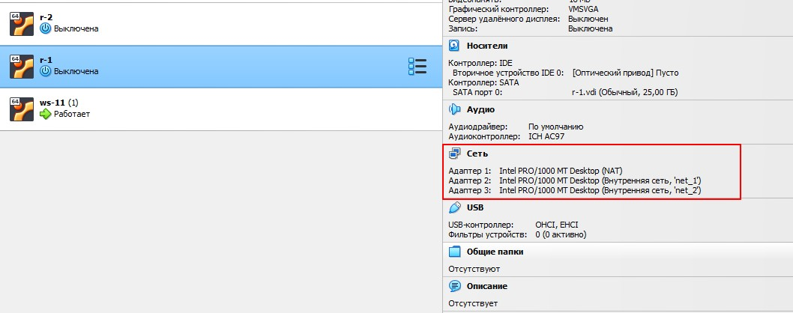
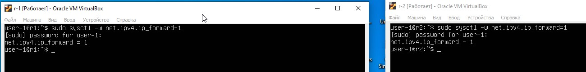
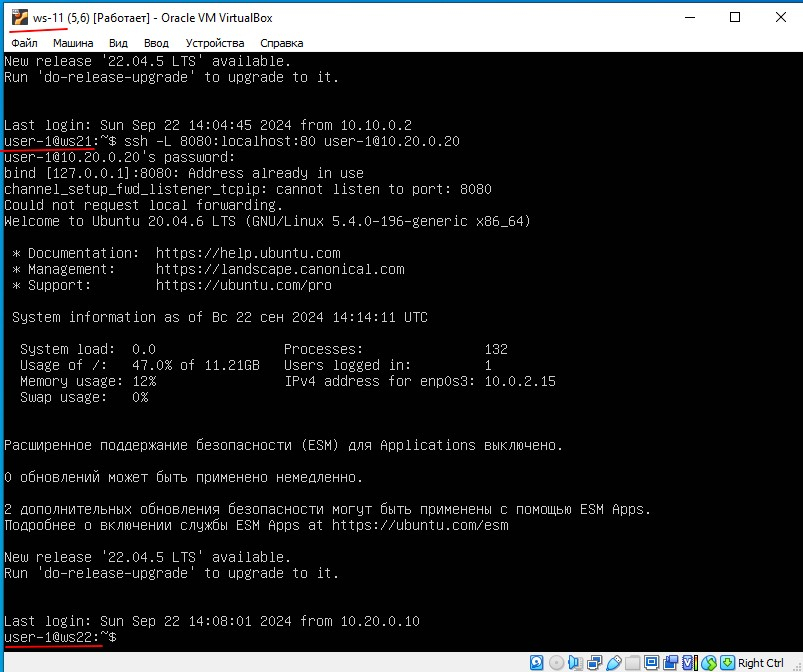
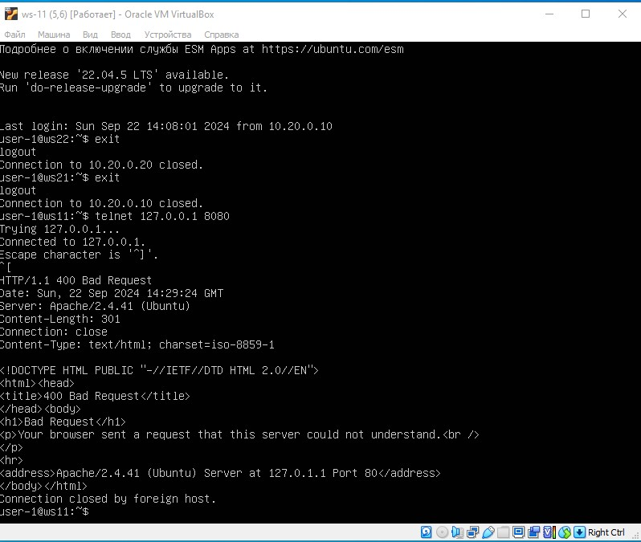

## Part 1. Инструмент ipcalc

**ipcalc** — это утилита, которая может выполнять простые манипуляции с адресами IPv4.

Инструмент ` ipcalc ` можно применять для следующих задач:
- проверить IP-адрес;
- показать рассчитанный широковещательный адрес;
- отображение имени хоста, определенного через DNS;
- отображение сетевого адреса или префикса.
В VB (виртуал бокс) поднимаем виртуальную машину ws1

Установка утилиты ` ipcalc `,вводим следующую команду:

> ` sudo apt install ipcalc `


### 1.1. Сети и маски

#### Определяем адрес сети *192.167.38.54/13* с помощью команды

> ` ipcalc 192.167.38.54/13 `


#### Перевод маски: 

> ` ipcalc 192.167.38.54/255.255.255.0 `

* префиксная форма записи */24* 
* двоичная форма записи *11111111.11111111.11111111.00000000*
  


> ` ipcalc 192.167.38.54/15 `

* обычная форма записи *255.254.0.0*
* двоичная *11111111.11111110.00000000.00000000*


> ` ipcalc 192.167.38.54/11111111.11111111.11111111.11110000 `

* эта запись эквивалентна *255.255.255.240* 
* префиксная */28*


#### Минимальный и максимальный хост в сети 12.167.38.4 при масках:

> ` ipcalc 12.167.38.4/8 `

* минимальный хост *12.0.0.1*
* максимальный хост *12.255.255.254* 


> ` ipcalc 12.167.38.4/255.255.0.0 `

эквивалентно

> ` ipcalc 12.167.38.4/255.255.0.0 `

* минимальный хост *12.167.0.1*
* максимальный хост *12.167.255.254*


> ` ipcalc 12.167.38.4/255.255.254.0 `

* минимальный хост *12.167.38.1*
* максимальный хост *12.167.39.254*


> ` ipcalc 12.167.38.4/4 `

* минимальный хост *0.0.0.1*
* максимальный хост *15.255.255.254*


### 1.2. localhost

Можно ли обратиться к приложению, работающему на localhost, со следующих IP:
`localhost` это адрес принадлежит к специальному диапазону адресов, который называется loopback.

Loopback адреса включают диапазон от `127.0.0.0` до `127.255.255.255`. Все адреса в этом диапазоне считаются локальными и используются для взаимодействия программ на одной и той же машине.
localhost, подразумевается использование адресов сети loopback, которая традиционно использует диапазон адресов `127.0.0.0/8`.

- `194.34.23.100`: Нет
- `127.0.0.2`: Да
- `127.1.0.1`: Да
- `128.0.0.1`: Нет

### 1.3. Диапазоны и сегменты сетей

#### Определить и записать в отчёт какие из перечисленных IP можно использовать в качестве публичного, а какие только в качестве частных: 10.0.0.45, 134.43.0.2, 192.168.4.2, 172.20.250.4, 172.0.2.1, 192.172.0.1, 172.68.0.2, 172.16.255.255, 10.10.10.10, 192.169.168.1. 

Частные IP-адреса определены в трех диапазонах:

```
10.0.0.0 - 10.255.255.255 (Class A)
172.16.0.0 - 172.31.255.255 (Class B)
192.168.0.0 - 192.168.255.255 (Class C)
```
Эти диапазоны не маршрутизируются в интернете и используются для локальных сетей.

IP-адреса, не входящие в эти диапазоны, являются публичными и могут использоваться в интернете.

* к публичным относятся следующие IP адреса: *134.43.0.2, 172.0.2.1, 192.172.0.1, 172.68.0.2, 192.169.168.1*


* к частным относятся следующие IP адреса: *10.0.0.45, 192.168.4.2, 172.20.250.4, 172.16.255.255, 10.10.10.10*


#### Определить и записать в отчёт какие из перечисленных IP адресов шлюза возможны у сети 10.10.0.0/18: 10.0.0.1, 10.10.0.2, 10.10.10.10, 10.10.100.1, 10.10.1.255


* из перечисленных IP адресов шлюзов у сети 10.10.0.0/18 возможны следующие: 10.10.0.2, 10.10.10.10, 10.10.1.255 .

## Part 2. Статическая маршрутизация между двумя машинами

Поднимаем вторую виртуальную машину ws2.

В настройках каждой машины во вкладке Сеть задаем Тип подключения: Внутренняя сеть.


#### С помощью команды *ip a* смотрим существующие сетевые интерфейсы


#### Описать сетевой интерфейс, соответствующий внутренней сети, на обеих машинах и задать следующие адреса и маски: ws1 - 192.168.100.10, маска /16, ws2 - 172.24.116.8, маска /12


Используем vim для открытия файла и установки в нём статического адреса.

> ` sudo vim /etc/netplan/00-installer-config.yaml `

- ` etc/netplan/00-installer-config.yaml ` - файл который нужно отредактировать на каждой машине. Этот файл отвечает за настройку интерфейсов сети.


Прописываем в файлы соответствующие строки.


#### Выполним команду *netplan apply* для перезапуска сервиса сети

> ` sudo netplan apply `


С помощью следующей команды перепроверяем настройки

> ` netstat -nr `


#### Добавим статический маршрут от одной машины до другой и обратно

> ` sudo ip route add 172.24.116.8 dev enp0s3 `

> ` sudo ip route add 192.168.100.0 dev enp0s3 `


#### Пропингуем соединение между машинами с помощью следующей команды

> ` ping -c 5 <IP-address> `

- ` -c ` - указывает количество пакетов.

> ` ping -c 5 172.24.116.8 `

> ` ping -c 5 192.168.100.10 `


### 2.2. Добавление статического маршрута с сохранением

Добавляем статический маршрут от одной машины до другой, редактируя файл ` etc/netplan/00-installer-config.yaml `.

> ` sudo vim etc/netplan/00-installer-config.yaml `

Добавляем строки в файл для создания статичного маршрута между машинами.


Применяем новые настройки с помощью команды 'sudo netplan apply' и пропингуем.

> ` ping -c 5 - 5ть кол-во пакетов `


## 3. Утилита iperf3

iperf3 — программа для измерения пропускной способности сети в реальном времени.

### 3.1. Скорость соединения

Переведи и запиши в отчёт:

```
8 Mbps = 1 MB/s(мегабит/c в мегабайт/c)

100 MB/s = 800000 Kbps(мегабайт/c в килобит/c)

1 Gbps = 1000 Mbps(гигабит/c в мегабит/c)
```

### 3.2. Утилита iperf3

Запускаем утилиту на ` ws1 ` в режиме сервер с флагом ` -s `. Она будет ожидать пока не запустится этаже утилита на ` ws2 ` в режиме клиента.

> ` iperf3 -s ` 

Следом запускаем на ` ws2 ` утилиту в режиме клиент с флагом ` -c ` и указываем IP-адрес ` ws1 `.

> ` iperf3 -c 192.168.100.10 ` 


## Part 4. Сетевой экран

### 4.1. Утилита iptables

Создаем файл ` /etc/firewall.sh `, имитирующий фаерволл, на ` ws1 ` и ` ws2 ` с помощью команды

> ` sudo touch /etc/firewall.sh `

Добавляем в файл следующие правила согласно задания:

> ` sudo vim /etc/firewall.sh `

1) на ` ws1 ` применить стратегию когда в начале пишется запрещающее правило, а в конце пишется разрешающее правило (это касается пунктов 4 и 5).

2) на ` ws2 ` применить стратегию когда в начале пишется разрешающее правило, а в конце пишется запрещающее правило (это касается пунктов 4 и 5).

3) открыть на машинах доступ для порта 22 (ssh) и порта 80 (http).

4) запретить *echo reply* (машина не должна "пинговаться”, т.е. должна быть блокировка на OUTPUT).

5) разрешить *echo reply* (машина должна "пинговаться").


Запустим файлы на обеих машинах командами

> ` sudo chmod +x /etc/firewall.sh `

> ` sudo bash /etc/firewall.sh `


Выполним
> ` sudo iptables -L `


Пропингуем.


Разница в том, что команды выполняются по порядку. Поэтому в ws1 пинг будет запрещен, так как запрещение стоит первее, а в ws2 будет разрешен, так как разрешение стоит первее.

### 4.2. Утилита nmap


#### Поиск машины, которая не "пингуется"

> ` ping IP-address `
Команду пинг мы применяли выше и нашли машину которая не пингуется.

В файле ` firewall.sh ` для первой машины первым было указано запрещающее правило, поэтому она не пингуется. Для проверки того чтобы показать, что хост машины запущен воспользуемся утилитой ` nmap `. 
Установим утилиту ` nmap ` с помощью следующей команды. Во время установки появится запрос, нужно будет согласиться.

> ` sudo apt install nmap `

Запускаем утилиту ` nmap ` командой (для проверки ищем в выводе ` nmap ` наличие строки ***Host is up***)

> ` sudo nmap IP-address `


#### Сохраняем дампы образов виртуальных машин.

Для сохранения образов машины в настройках машины выбираем *Опции - Снимки* и сохраняем дампы.


## Part 5. Статическая маршрутизация сети

Создадим сеть, по следующей схеме


#### Поднимаем пять виртуальных машин (3 рабочие станции (ws11, ws21, ws22) и 2 роутера (r1, r2)).

Сначала создаём одну виртуальную машину. Потом нажимаем правую клавишу мыши на вновь созданной машине, вибираем *Клонировать...* и клонируем ещё 4 машины с соответствующими заданию именами (` ws11 `, ` ws21 `, ` ws22 ` и ` r1 `, ` r2 `).

Задаём следующие настройки виртуальным машинам:

**I** Для машины ` Router r1 ` в *Настроить - Сеть* выставляем:
- *Адаптер_1* оставляем как есть (*Тип подключения: NAT*);

- включаем *Адаптер_2*, выставляем *Тип подключения: Внутренняя сеть* и устанавливаем имя ` int_net_1`;

- включаем *Адаптер_3*, выставляем *Тип подключения: Внутренняя сеть* и устанавливаем имя ` int_net_2`.

В итоге настройки для ` Router r1 ` должны выглядеть так



Запускаем ` r1 ` и меняем имя хоста на соотвтетствующее:

> ` sudo hostnamectl set-hostname r1 `

Перезагружаем машину ` r1 `.

**II** Для машины ` Router r2 `:
- *Адаптер_1* оставляем как есть (*Тип подключения: NAT*);
- Включаем *Адаптер_2*, выставляем *Тип подключения: Внутренняя сеть* и устанавливаем имя ` int_net_2`;
- Включаем *Адаптер_3*, выставляем *Тип подключения: Внутренняя сеть* и устанавливаем имя ` int_net_3`.

В итоге настройки для ` Router r2 ` должны выглядеть так


Запускаем ` r2 ` и меняем имя хоста на соотвтетствующее:

> ` sudo hostnamectl set-hostname r2 `

Перезагружаем машину ` r2 `.

**III** Для машины ` PC-ws11 ` в *Настроить - Сеть*:
- *Адаптер_1* оставляем как есть (*Тип подключения: NAT*);
- включаем *Адаптер_2*, выставляем *Тип подключения: Внутренняя сеть* и устанавливаем имя ` int_net_1`.


**IV** Для машин ` ws21 ` и ` ws22 `:
- *Адаптер_1* оставляем как есть (*Тип подключения: NAT*);
- включаем *Адаптер_2*, выставляем *Тип подключения: Внутренняя сеть* и устанавливаем имя ` int_net_3`.


Запускаем все ` ws ` и меняем  хоста на соотвтетствующее:

- для машины ` ws11 ` 

> ` sudo hostnamectl set-hostname ws11 `

- для машины ` ws21 `

> ` sudo hostnamectl set-hostname ws21 `

- для машины ` ws22 `

> ` sudo hostnamectl set-hostname ws22 `

Перезагружаем машины ` ws11 `, ` ws21 ` и ` ws22 `.

### 5.1. Настройка адресов машин

#### Настроить конфигурации машин в etc/netplan/00-installer-config.yaml согласно сети на рисунке.

В файле ` etc/netplan/00-installer-config.yaml ` прописываем настройки для машин, согласно схемы сети. Используем следующую команду на всех машинах для редактирования адресов.

> ` sudo vim /etc/netplan/00-installer-config.yaml `


#### Перезапустить сервис сети и проверить адрес машины

Перезапускаем сервисысети.

> ` sudo netplan apply `


Проверим, что адрес машины задан верно. 

> ` ip -4 a `


Пропингуем ` ws22 ` с ` ws21 ` с помощью команды 

> ` ping -c 5 10.20.0.20 `
 


Аналогично пингуем ` r1 ` с ` ws11 ` 

> ` ping -c 5 10.10.0.2 `


### 5.2. Включение переадресации IP-адресов.

Для включения переадресации IP, выполняем команду на роутерах 

> ` sudo sysctl -w net.ipv4.ip_forward=1 `



Откроем файл ` /etc/sysctl.conf ` 

> ` sudo vim or nano /etc/sysctl.conf `

Раскомментируем строку ` net.ipv4.ip_forward = 1 ` и сохраним изменения. Теперь IP-переадресация включена на постоянной основе.


### 5.3. Установка маршрута по-умолчанию

Настраиваем маршрут по-умолчанию (шлюз) для рабочих станций. Для этого добавляем ` gateway4: ip роутера ` в файле конфигураций ` etc/netplan/00-installer-config.yaml `

> ` sudo vim /etc/netplan/00-installer-config.yaml `


После изменения настроек применяем команду для вступления в силу изменений

> ` sudo netplan apply `


Вызовем ` ip r `, чтобы показать, что  маршрут добавился в таблицу маршрутизации


Пропингуем с ` ws11 ` роутер ` r2 `. 

Чтобы посмотреть какие девайсы можно прослушать

> ` tcpdump -D ` 

Запускаем на ` r2 ` утилиту ` tcpdump `, она позволяет прослушать порты и вывести на экран информацию с каких IP адресов приходят пакеты. В данном случае слушаем интерфейс ` enp0s8 `

> ` tcpdump -tn -i enp0s8 `

Запускаем ` ping ` на ` ws11 ` 

> ` ping -c 5 10.100.0.12`


Пинг не проходит, т.к. роутер "не знает" куда вернуть ответ, при этом передача пакетов с машины осуществляется


### 5.4. Добавление статических маршрутов

#### Добавить в роутеры r1 и r2 статические маршруты в файле конфигураций.

Добавим в роутеры r1 и r2 статические маршруты в файле конфигураций. ` etc/netplan/00-installer-config.yaml `.

> ` sudo nano /etc/netplan/00-installer-config.yaml `

Для вступления изменений в силу воспользуемся командой

> ` sudo netplan apply `


С помощью ` ip r ` проверяем настройки на роутерах


Запустить команды на ` ws11 `

> ` ip r list 10.10.0.0/18 `

> ` ip r list 0.0.0.0/0 `


Для адреса *10.10.0.0/18* был выбран маршрут, отличный от *0.0.0.0/0* (он попадает под маршрут по-умолчанию), т.к. машина ` ws11 ` соединена с сетью *10.10.0.0/18* по своему IP-адресу *10.10.0.2*, для других адресов используется маршрут по умолчанию, который указан в файле *10.10.0.1*.

### 5.5. Построение списка маршрутизаторов

Для установки утилиты на ` ws11 ` используем команду 

> ` sudo apt install traceroute `

Запустим на ` r1 ` команду дампа 

> ` tcpdump -tnv -i enp0s8 `

- -n - не конвертировать адреса в имена;
- -t - не выводить время при выводе каждой строкчи дампа;
- -v - при синтаксическом анализе и выводить более подробную информацию. Например, печатаются время создания, общая длина и параметры IP-пакета. Также включает дополнительные проверки целостности пакетов, такие как проверка контрольной суммы заголовка IP и ICMP.


При помощи утилиты ` traceroute ` построим список маршрутизаторов на пути от ` ws11 ` до ` ws21 `. 


>Каждый пакет проходит на своем пути определенное количество узлов, пока достигнет своей цели. Причем, каждый пакет имеет свое время жизни. Это количество узлов, которые может пройти пакет перед тем, как он будет уничтожен. Этот параметр записывается в заголовке TTL, каждый маршрутизатор, через который будет проходить пакет уменьшает его на единицу. При TTL=0 пакет уничтожается, а отправителю отсылается сообщение Time Exceeded.

>Команда traceroute linux использует UDP пакеты. Она отправляет пакет с TTL=1 и смотрит адрес ответившего узла, дальше TTL=2, TTL=3 и так пока не достигнет цели. Каждый раз отправляется по три пакета и для каждого из них измеряется время прохождения. Пакет отправляется на случайный порт, который, скорее всего, не занят. Когда утилита traceroute получает сообщение от целевого узла о том, что порт недоступен трассировка считается завершенной.

### 5.6. Использование протокола ICMP при маршрутизации

Запустим на ` r1 ` перехват сетевого трафика, проходящего через ` enp0s8 ` с помощью команды

> ` sudo tcpdump -n -i enp0s8 icmp `

Пропингуем с ` ws11 ` несуществующий IP (например, 10.30.0.111) с помощью команды 

> ` ping -c 1 10.30.0.111 `


Сохраняем дампы образов виртуальных машин

## Part 6. Динамическая настройка IP с помощью DHCP

### 6.1 Настройка службы DHCP на r2

Если утилита ` isc-dhcp-server ` ещё не установлена, то файла ` /etc/dhcp/dhcpd.conf ` ещё не существует в нужном виде. Соотвтетственно для работы с протоколом **DHCP** сначала надо установить эту утилиту

> ` sudo apt-get install isc-dhcp-server `

Теперь для **r2** можем настроить в файле ` /etc/dhcp/dhcpd.conf ` конфигурацию службы  ` DHCP `

Указываем адрес маршрутизатора по-умолчанию, DNS-сервер и адрес внутренней сети.

Открываем файл ` /etc/dhcp/dhcpd.conf ` для редактирования

> ` sudo vim /etc/dhcp/dhcpd.conf `


2) в файле ` /etc/resolv.conf `(содержит адреса серверов имен, к которым имеет доступ данная система) прописываем ` nameserver 8.8.8.8 `

> ` sudo nano /etc/resolv.conf `


Перезагрузим службу **DHCP**

> ` systemctl restart isc-dhcp-server `


Можно проверить статус службы

> ` sudo systemctl status isc-dhcp-server `


Изменим настройки машин **ws21** и **ws22** в файле конфигурации, чтобы сделать протокол **DHCP** активным. 

Перезагружаем виртуальную машину **ws21 и ws22**

> ` sudo systemctl reboot `

Проверяем присвоенный устройствам адрес


Проверим соединение машины **ws22** с **ws21** 


### 6.2 Указать MAC-адреса 

Чтобы указать MAC-адрес у **ws11**, в файл ` etc/netplan/00-installer-config.yaml ` надо добавить строки: ` macaddress: 10:10:10:10:10:BA `, ` dhcp4: true `

> ` sudo nano /etc/netplan/00-installer-config.yaml `

> ` sudo netplan apply `


Заходим в менеджер виртуальных машин VirtualBox и там настраиваем **ws11** MAC-адрес

Для **r1** настроим аналогично **r2**, но выдачу адресов сделаем с жесткой привязкой к MAC-адресу (**ws11**).

> ` sudo apt-get install isc-dhcp-server `

> ` sudo vim /etc/dhcp/dhcpd.conf `


> ` sudo vim /etc/resolv.conf `


Проводим аналогичные тесты - смотрим какой адрес назначен машине **ws11**

> ` ip a `


Сохраняем дампы.

## Part 7. NAT

Для работы с сервером ` apache2 `, установим его на машины ` r1 `, ` r2 ` и ` ws22 `.

> ` sudo apt install apache2 `


### 7.1 Делаем сервер Apache2 общедоступным.

В файле ` /etc/apache2/ports.conf ` на ` ws22 ` и ` r2 ` меняем строку ` Listen 80 ` на ` Listen 0.0.0.0:80 `.

> ` sudo nano /etc/apache2/ports.conf `


Запустить веб-сервер **Apache**  на ` ws22 ` и ` r1 `

> ` service apache2 start ` 
> ` ssystemctl status apache2  ` 


### Добавь в фаервол, созданный по аналогии с фаерволом из Части 4, на r2 следующие правила:

1) Удаление правил в таблице filter - ` iptables -F `
2) Удаление правил в таблице "NAT" - ` iptables -F -t nat `
3) Отбрасывать все маршрутизируемые пакеты - ` iptables --policy FORWARD DROP `


Запустим файлы на обеих машинах командами

> ` sudo chmod +x /etc/firewall.sh `

> ` sudo bash /etc/firewall.sh `


 При запуске файла ` firewall.sh ` с этими правилами, ` ws22 ` не должна "пинговаться" с ` r1 `.

> ` ping -c 5 10.20.0.29 `


Проверяем соединение между ` ws22 ` и ` r1 `

> ` ping -c 5 10.100.0.11 `


4) Разрешить маршрутизацию всех пакетов протокола ICMP, для этого прописываем правило для протокола *icmp* и цепочки *FORWARD*

> ` sudo nano /etc/apache2/ports.conf `


Теперь при запуске файла ` firewall.sh ` с этими правилами, ` ws22 ` должна "пинговаться" с ` r1 `

Проверяем соединение между ` r1 ` и ` ws22 `

> ` ping -c 5 10.20.0.... `


Добавляем в файл ещё два правила:

5) Включаем **SNAT**, а именно маскирование всех локальных ip из локальной сети, находящейся за ` r2 ` (по обозначениям из Части 5 - сеть 10.20.0.0)

6) Включаем **DNAT** на 8080 порт машины ` r2 ` и добавим к веб-серверу Apache, запущенному на ` ws22 `, доступ извне сети

> ` sudo nano /etc/apache2/ports.conf `


Проверяем соединение по TCP для SNAT, для этого с ` ws22 ` подключаемся к серверу Apache на ` r1 ` командой ` telnet [адрес] [порт] `

> ` telnet 10.100.0.11 80 `


Проверить подмену IP-адреса можно с помощью команды ` tcpdump ` - пингуем с машины ` ws22 ` роутер ` r1 `, в выводе ` tcpdump ` будет отображаться с какого адреса идет запрос - IP-адрес ` r2 ` 


Проверяем соединение по TCP для DNAT, для этого с ` r1 ` подключаемся к серверу Apache на ` ws22 ` (обращаться по адресу ` r2 ` и порту 8080)

> ` telnet 10.100.0.12 8080 `


Сохраняем дампы образов виртуальных машин


## Part 8. Дополнительно. Знакомство с SSH Tunnels

Запускаем виртуальные машины со следующими настройками


Eсли необходимо, то устанавливаем ` apache2 `предварительно  обновив систему.

> ` sudo apt update `

> ` sudo apt upgrade -y `

Устанавливаем ` apache2 `

> ` sudo apt install apache2 `
Запускаем на r2 фаервол с правилами из части 7.


Запускаем веб-сервер ` Apache ` на ` ws22 ` только на ` localhost ` (то есть в файле ` /etc/apache2/ports.conf ` изменить строку ` Listen 80 ` на ` Listen localhost:80 `)

> ` sudo nano /etc/apache2/ports.conf `


**I** Воспользуемся ` Local TCP forwarding ` с ` ws21 ` до ` ws22 `, чтобы получить доступ к веб-серверу на ` ws22 ` с ` ws21 `


> ` ssh -L 8080:127.0.0.1:80 10.20.0.20 `


Проверяем процессы на машине ` ws22 ` после создания соединения 

> ` ps aux | grep sshd `


**II** Воспользоваться ` Remote TCP forwarding ` c ` ws11 ` до ` ws22 `, чтобы получить доступ к веб-серверу на ` ws22 ` с ` ws11 `.

Так как мы не можем соедениться с ws11 напрямую к ws22, соеденяем ws11 -> ws21, а оттуда подключаемся с ws21->ws22. Эта схема работает потому что подмена ip идет на роутере r2, в то время как машины ws21 и ws22 находятся внутри локальной сети и так как подменя идет только на ws22, мы можем подключиться в ws21, а от туда, соответственно у нас будет допуск к локальной сети ws21, что позволит подключиться к ws22.

На ws11 соединяемся к ws21

 `ssh -R 8080:localhost:80 a@10.20.0.10`

 

 Теперь подключившись с ws11 к ws21 -> Локально подключаемся к ws22 
 
 `ssh -L 8080:localhost:80 a@10.20.0.20`

 

### Для проверки, сработало ли подключение в обоих предыдущих пунктах, перейди во второй терминал (например, клавишами Alt + F2) и выполни команду:
`telnet 127.0.0.1 [локальный порт]`



Сохрани дампы образов виртуальных машин.

